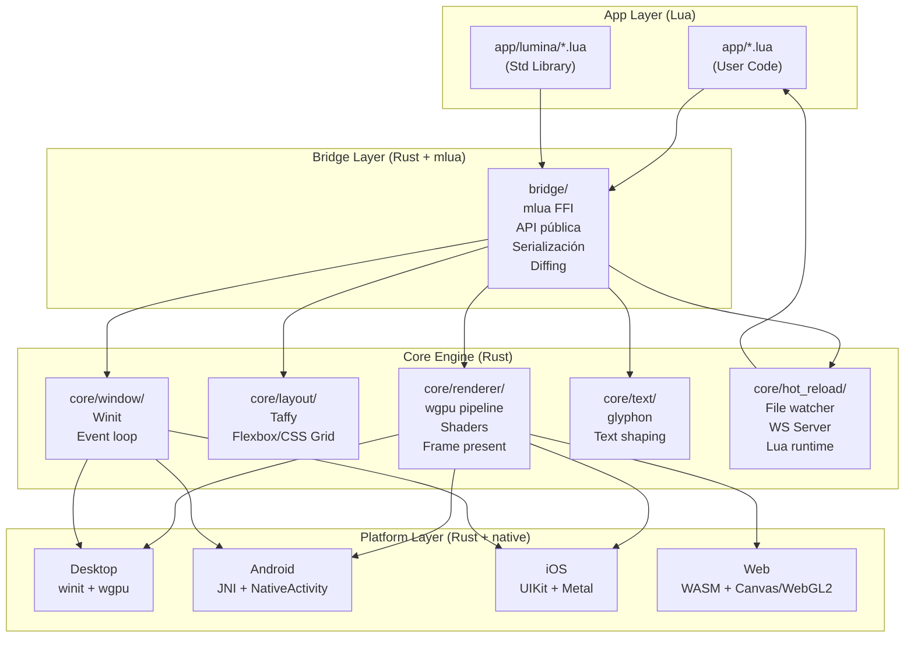

# Lumina Framework — Arquitectura

## Diagrama C4 Level 2 (Containers)

## Capas

### App Layer (Lua)
Código del desarrollador. UI declarativa, estado, lógica de negocio.
- `app/*.lua` — entrada de la aplicación
- `app/lumina/*.lua` — librería estándar de componentes (View, Text, Button, etc.)

### Bridge Layer (Rust)
Comunicación Lua ↔ Rust via mlua.
- `api.rs` — funciones expuestas a Lua
- `serde.rs` — serialización del árbol UI
- `diff.rs` — diffing de virtual DOM para eficiencia

### Core Engine (Rust)
Motor de renderizado, layout y eventos.
- **Renderer**: wgpu (Vulkan/Metal/DX12/WebGL2)
- **Layout**: Taffy (Flexbox/CSS Grid)
- **Window**: Winit (eventos, ventanas)
- **Text**: glyph handling con cosmic-text o glyphon
- **Hot Reload**: file watcher + WebSocket server

### Platform Layer (Rust + platform code)
Adaptadores por plataforma.
- Desktop: nativo vía winit + wgpu
- Android: JNI + NativeActivity
- iOS: UIKit + Metal via objc bindings
- Web: WASM + canvas HTML5

## Lema

> **Crea más rápido. Hazlo completo. Extiéndelo todo.**
